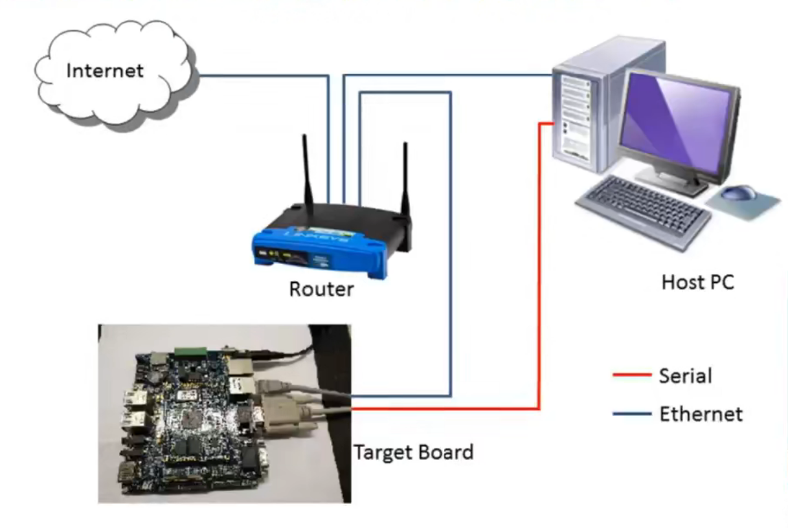

# RISC-V嵌入式开发
------

## 1.什么是嵌入式开发

嵌入式开发是比较综合的一种技术，它是在特定的硬件环境下针对某款硬件进行开发，是一种系统级别的与硬件结合比较紧密的软件开发技术。

以下图为例：在非嵌入式开发开发中，只需要一台装有操作系统的主机（Host PC）即可，在这个操作系统上进行开发无需关心底层的硬件实现，也就是纯粹的进行软件开发。

但是在嵌入式开发中，所开发的程序需要运行在单独的目标机（Target Board）上，因而需要搭建一个小型的开发环境，通过路由器（Router）使主机和目标机进行通信。在主机中进行软件的编辑、编译、调试等工作，再将开发好的软件在目标机上运行。



在实际开发中，可以用模拟器来模拟目标机，比如后面要介绍到的QEMU模拟器。

## 2.交叉编译

在嵌入式开发中，可以将参与编译和运行的机器分成以下几种角色：

+ 构建(build)系统：生成编译器可执行程序的计算机，比如编译器GCC，最初用于开发这个编译器GCC的系统即称为构建系统。
+ 主机(host)系统：由构建系统开发出编译器后，通过运行编译器可执行程序，能够对应用程序进行编译链接，完成这一过程的机器成为主机系统。
+ 目标(target)系统：运行应用程序（这个应用程序在主机系统中进行开发）的计算机系统即为目标系统。

注意：构建系统开发的编译器最终运行在主机系统中；主机系统中开发的应用程序最终运行在目标系统中。此外，这三种系统可以是同一操作系统，也可以不同。

根据上面提到的三种主机的不同组合，我们可以将编译方式分为本地编译和交叉编译：

+ 本地（native）编译中，构建系统、主机系统和目标系统为同一系统，可用公式表达为build==host==target。

+ 交叉（cross）编译中，构建系统和主机系统采用同一系统，但是目标系统采用另一系统。也即在主机系统中开发的应用程序并不是为主机系统开发的，而是专门为目标系统开发的（主机系统与目标系统采用的操作系统不同），可用公式表达为：build==host !=target。下图是交叉编译的示意图：

  

  

## 3.调试器GDB 

 GDB 即 The GNU Project Debugger（GNU项目调试器）的缩写，用于查看另一个程序在执行过程中正在执行的操作，或该程序崩溃时正在执行的操作。

调试可分为本地调试和远程调试两种：本地调试中所开发的程序运行在本地，远程调试中所开发的程序是运行在交叉环境中的。下图是这两种调试过程的示意图：


在本地调试中（如上图左侧示意图），对于编译链接后生成的可执行文件（比如hello.out），在调试的的过程中（如执行gdb hello.out），gdb进程会fork出一个子进程用于执行被调试的目标程序。gdb进程和子进程通过ptrace系统调用进行通信。当子进程运行到断点处时，将会进入暂停状态，此时调试者就可以查看被调试程序在断点处的各种信息。

在远程调试中，需要在目标机运行gdbserver的远程服务，由该服务来代理调试过程（如上图右侧示意图）。被调试的目标程序运行在目标机器上（目标机器可以用模拟器进行模拟，如QEMU），而进行调试的过程是在调试机器上进行的。目标机器和调试机器通过网络进行连接。

此外，GDB支持调试多种语言，例如Assembly、C、C++、Fortran、Go、Objective-C、Pascal、Rust等。

## 4.模拟器QEMU

QEMU（Quick EMUlator,快速模拟器）是一套由 Fabrice Bellard 编写的以GPL许可证分发源码的计算机系统模拟软件，主要运行在GNU/Linu平台。它支持多种体系架构，譬如IA-32(x86)，AMD64，MIPS 32/64，RISC-V 32/64等。

QEMU有两种运作模式：

+ User mode：直接运行应用程序。这个过程中模拟器并没有模拟出操作系统，只模拟了操作系统之上的应用层。下面是一个例子：

  ```shell
  $vim hello.c	# 先编辑源文件
  #include <stdio.h>
  void main(){
  	printf("hello world!\n");
  }
  $riscv64-unknown-efl-gcc -march=rv32ima -mabi=ilp32 hello.c	# 用特定的编译器（通过参数指定risc-v的ISA为rv32ima）对源文件（hello.c）进行编译，得到目标文件a.out
  $qemu-riscv32 a.out		# 在qemu环境中以user mode的方式运行目标文件a.out
  hello world!
  ```

+ System mode：模拟整个计算机系统，包括中央处理器及其他周边设备。

## 5.项目构造工具Make

make是一种自动化工程管理工具，make工具与Makefile文件相配合来完成构建过程，在Makefile中描述了构建工程过程中所管理的对象，以及如何构建工程的过程。

make可以通过两种方式找到Makefile文件：

+ 隐式查找：默认情况下会在当前目录中寻找名为“GNUmakefile”，或“makefile”，或“Makefile”的文件。
+ 显式查找：通过参数 -f指定Makefile文件。

Makefile由一条或多条队则组成，每条规则由三部分组成：

+ 首先是target，可以是obj文件，也可以是可执行文件。
+ 然后是prerequisites，这是为了生成target所需要的依赖。
+ 最后是command，这是为了生成target所需要的执行的命令，可以有多条。

这是一个**文件的依赖关系**，也就是说，target这一个或多个的目标文件依赖于prerequisites中的文件，其生成规则定义在command中。下面是一个例子：

```makefile
hello.out: hello.o	# 规则1：链接器将hello.o和标准库文件组合，形成最终的可执行文件hello.out
	gcc hello.o -o hello.out
hello.o: hello.s	# 规则2：汇编器将hello.s转化为机器指令，生成hello.o文件
	gcc -c hello.s -o hello.o
hello.s: hello.i	# 规则3：编译器将hello.i转为为汇编指令，生成汇编语言文件hello.s
	gcc -S hello.i -o hello.s
hello.i: hello.c	# 规则4：对源文件hello.c进行预处理，生成hello.i文件
	gcc -E hello.c -o hello.i
```

上面的过程其实就是源程序经过预处理、编译、汇编、链接，生成可执行文件的过程。

第一条规则是目标规则，它依赖于文件hello.o，由于目录中没有该文件，因而make会查看是否存在hello.o规则，检索后发现规则2可以生产hello.o文件，因而转去执行规则2。由于规则2依赖于规则3生成的hello.out文件，因而make将转去执行规则3，而规则3依赖于规则4中的hello.i文件，因而make在执行规则3时会转去执行规则4。

综合来看，上面一系列命令的执行顺序为：

```makefile
gcc -E hello.c -o hello.i	# 规则4：预处理
gcc -S hello.i -o hello.s	# 规则3：编译
gcc -c hello.s -o hello.o	# 规则2：汇编
gcc hello.o -o hello.out	# 规则1：链接
```

此外，Makefile还可以包含其他元素：例如当一个文件当中有多条规则时，make工具会默认首先执行第一条规则。但如果最终目标并没有编写为第一条规则，则可以通过缺省规则（`.DEFAULT_GOAL`）进行指定。

Makefile中还可以包含伪规则（`.PHONT`），伪规则并不生成target文件，它的target是一个标签。由于伪规则不生成文件，所以make无法生成它的依赖关系和决定它是否要执行，我们只有显示的在make命令中指定执行伪规则时才能使其生效。